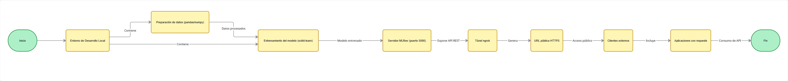

# Despliegue de modelos

## Infraestructura

- **Nombre del modelo:** LogisticRegressing Heart_failure
- **Plataforma de despliegue:** Se utilizo ngrok para para exponer el servidor de MLflow de forma publica y posteriormente se desplegó haciendo uso de MLflow
- **Requisitos técnicos:** 

## Especificaciones del Entorno

| Categoría | Requisito | Versión/Especificación | Notas |
|-----------|-----------|------------------------|-------|
| **Lenguaje Base** | Python | 3.8 - 3.11 | Recomendado 3.9 o superior |
| **Framework ML** | MLflow | ≥ 2.0.0 | Para tracking y despliegue del modelo |
| **Túnel Público** | pyngrok | ≥ 5.0.0 | Requiere cuenta en ngrok.com |
| **Procesamiento de Datos** | pandas | ≥ 1.3.0 | Manipulación de datos estructurados |
| **Computación Numérica** | numpy | ≥ 1.21.0 | Operaciones matemáticas |
| **Machine Learning** | scikit-learn | ≥ 1.0.0 | Para train_test_split y modelos |
| **Cliente HTTP** | requests | ≥ 2.25.0 | Para pruebas de API |

- **Requisitos de seguridad:** 
    - autenticación
    - Cifrado (HTTP/TLS)
    - Rate Limiting para evitar ataques DDoS
    - Evitar archivos pickle
    - Registro de peticiones
    
- **Diagrama de arquitectura:**

## Código de despliegue

- **Archivo principal:** scripts/evaluation/Despliegue_Modelo.ipynb
- **Rutas de acceso a los archivos:**

    **Set de datos**:  https://raw.githubusercontent.com/Dovallec/Heart_Failure_Analysis/master/data/heart.csv

- **Variables de entorno:**

        Para almacena el token y lanzar la app usando ngrok
        os.environ["NGROK_TOKEN"] = token

        para hacer el seguimiento de la url
        os.environ["MLFLOW_TRACKING_URI"] = "http://localhost:5000"

## Documentación del despliegue

- **Instrucciones de instalación:** 
    1. Instalar Dependencias (os, mlflow, pandas, numpy, IPython, pyngrok, scikit-learn, requests)
    2. Configurar el Token de ngrok
- **Instrucciones de configuración:** 
    1. Configurar MLflow

            mlflow.set_tracking_uri("http://localhost:5000")

            experiment_name = "heart_failure_logistic"
            mlflow.set_experiment(experiment_name)

            exp = mlflow.get_experiment_by_name(experiment_name)
            exp_id = exp.experiment_id
            exp_id

    2. Configuracion para el seguimiento de la URL

            import os

            os.environ["MLFLOW_TRACKING_URI"] = "http://localhost:5000"
            print("MLFLOW_TRACKING_URI:", os.environ["MLFLOW_TRACKING_URI"])

            command = """
            mlflow models serve -m 'models:/heart_failure_logistic/1' -p 8001 --env-manager 'local' &
            """
            get_ipython().system_raw(command)

- **Instrucciones de uso:** 
    1. Mediante el uso de la librería requests se hace la solicitud post para enviar datos y obtener una respuesta

            r = requests.post(
            "http://localhost:8001/invocations",
            json={"inputs": data_request}
            )

            print("Respuesta del modelo:", r.text)

- **Instrucciones de mantenimiento:** 
Para llevar un adecuado mantenimiento del modelo de Machine Learning, es altamente recomendado hacer uso de herramientas como **EVIDENTLY AI**, la cual nos permite visualizar los distintos tipos de drifting que afectan a nuestro modelo, como: label drifting, feature drifting, concept drifting y data drifting. De este modo, podemos saber cuándo es el momento adecuado para actualizar nuestro modelo con nueva información y reentrenarlo, ya sea a causa de un cambio en el ambiente sobre el cual está trabajando o una variación en la manera en que se relacionan nuestras variables.